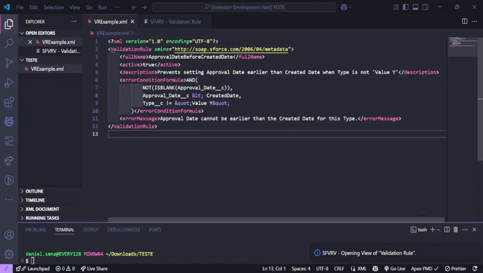
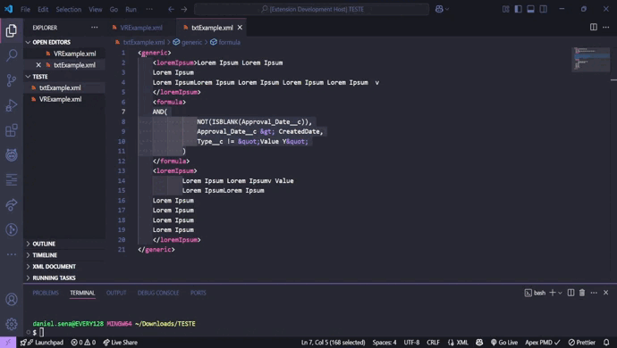

# Visualizer Validation Rules Salesforce

A Visual Studio Code extension to easily view and edit Salesforce Validation Rules formulas in XML format.

## ⚙️ Features

- View full Salesforce Validation Rules (`<errorConditionFormula>` tag) with a clean formatted preview.
- View only the selected XML snippet.
- Edit the formula in a Webview panel and save changes back to the original XML file.
- Two commands provided:
  - **Validation Rule Visualize** — opens the entire Validation Rule XML. - `Ctrl + Shift + F9`
  - **Visualize Selection Only** — opens just the current text selection.

### Transform codes in the Viewer
| FROM / TO   | TO / FROM  |
|-------------|------------|
| &amp        |     &      |
| &lt         |     <      |
| &gt         |     >      |
| &apos       |     '      |
| &quot       |     "      |

## 🖼️ Examples

### 🖼️ View and Edit Salesforce Validation Rules



---

### 🖼️ View and Edit Others Formulas (Selection Only)




## 📦 Requirements

- Visual Studio Code
- Salesforce project with Validation Rule XML files

## 🛠️ Commands

| Command                     | Description                                         | Keybind                  |
|-----------------------------|-----------------------------------------------------| -------------------------| 
| `Validation Rule Visualize` | View the `<errorConditionFormula>` in the active XML file | `Ctrl + Shift + F9` |
| `Visualize Selection Only`  | View the currently selected XML snippet in the editor | - |

Activate commands via `Ctrl+Shift+P` and typing the command name.

## 🧪 How it works

- Detects the active XML document or the current selection.
- Parses and shows content in a Webview panel.
- Allows editing and saving directly back into the original XML file.

## ⚠️ Known Issues

- Only XML files are supported.
- The `<errorConditionFormula>` tag must exist for full validation rule preview.
  - If the tag does not exist, you can select a formula snippet to view.
- Save button will not appear if no selection or unsupported file is active.

**Enjoy coding your Salesforce Validation Rules with Visualizer Validation Rules Salesforce!**

## 🛠️ Contribution
Contributions are welcome!
Feel free to open issues, pull requests, or suggest improvements.

Visual Studio Code Extension Manager: ```npm install @vscode/vsce```

```npm install``` to install the dependencies

```vsce package``` to generate the packages