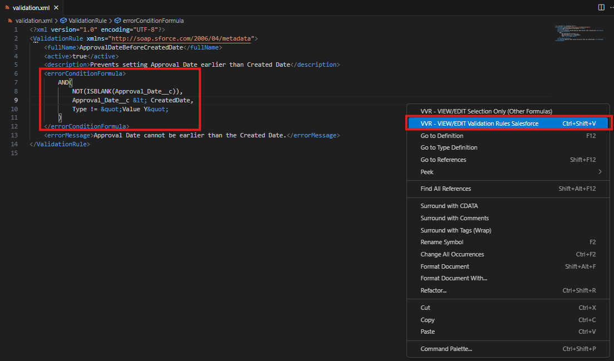
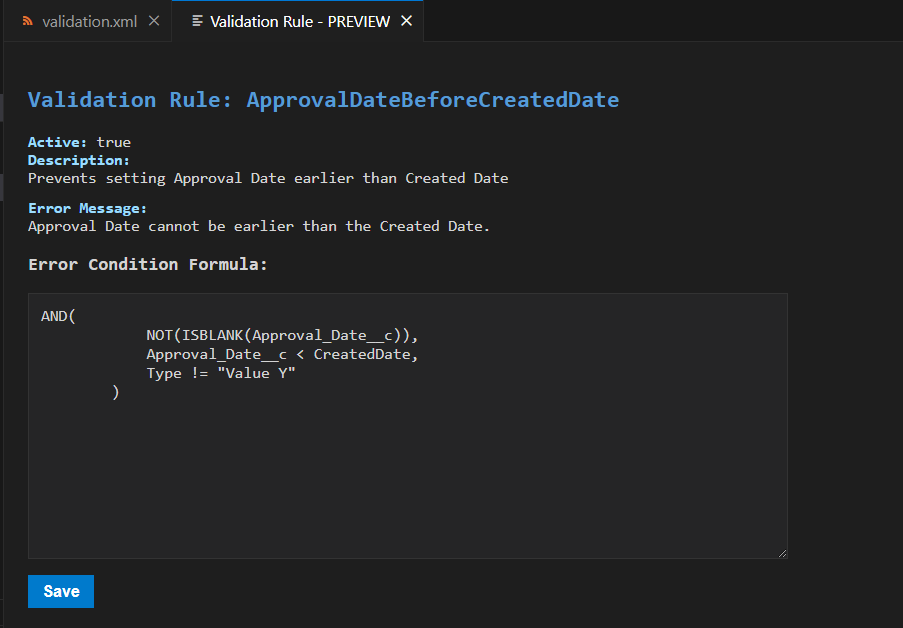
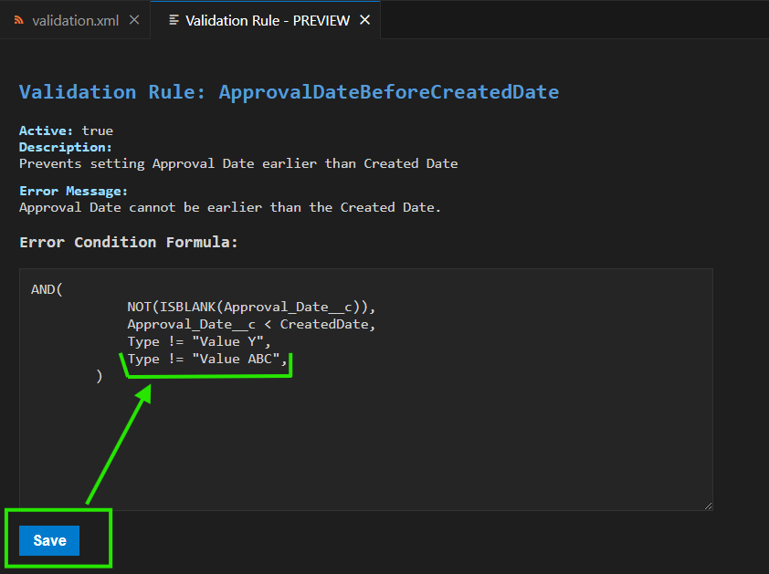
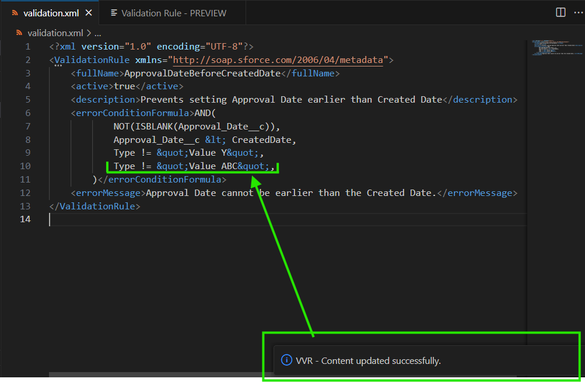
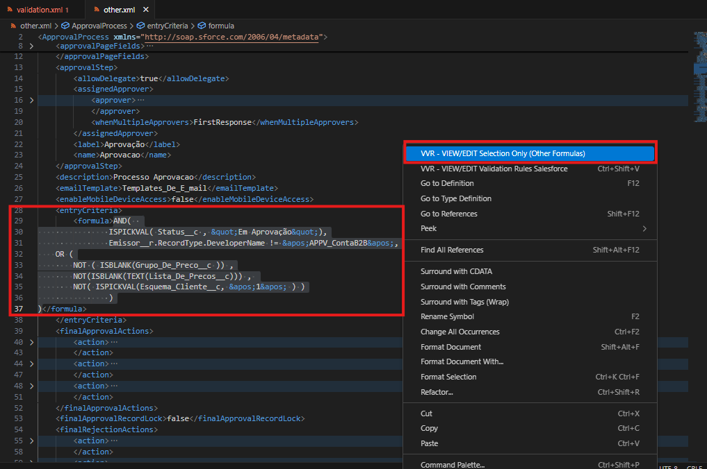
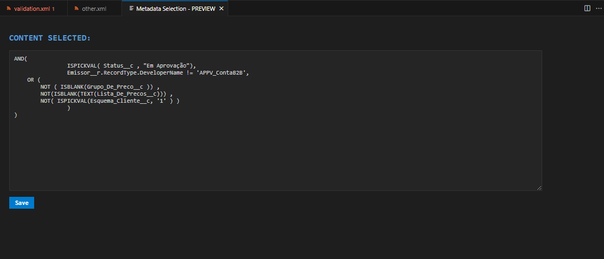

# Visualizer Validation Rules Salesforce

A Visual Studio Code extension to easily view and edit Salesforce Validation Rules formulas in XML format.

## ⚙️ Features

- View full Salesforce Validation Rules (`<errorConditionFormula>` tag) with a clean formatted preview.
- View only the selected XML snippet.
- Edit the formula in a Webview panel and save changes back to the original XML file.
- Two commands provided:
  - **Visualize Validation Rule** — opens the entire Validation Rule XML. - `Ctrl + Shift + V`
  - **Visualize Selection Only** — opens just the current text selection.

## 🖼️ Examples

### 🖼️ View and Edit Salesforce Validation Rules

| Description          | PrintScreen                                           |
|----------------------|-------------------------------------------------------|
| Validation Rules - 1 |  |
| Validation Rules - 2 |  |
| Validation Rules - 3 |  |
| Validation Rules - 4 |  |

---

### 🖼️ View and Edit Others Formulas (Selection Only)
| Description        | PrintScreen                                       |
|--------------------|---------------------------------------------------|
| Selection Only - 1 |  |
| Selection Only - 2 |  |

## 📦 Requirements

- Visual Studio Code version 1.70 or higher
- Salesforce project with Validation Rule XML files

## 🛠️ Commands

| Command                     | Description                                         | Keybind                  |
|-----------------------------|-----------------------------------------------------| -------------------------| 
| `Visualize Validation Rule` | View the `<errorConditionFormula>` in the active XML file | `Ctrl + Shift + V` |
| `Visualize Selection Only`  | View the currently selected XML snippet in the editor | - |

Activate commands via `Ctrl+Shift+P` and typing the command name.

## 🧪 How it works

- Detects the active XML document or the current selection.
- Parses and shows content in a Webview panel.
- Allows editing and saving directly back into the original XML file.

## ⚠️ Known Issues

- Only XML files are supported.
- The `<errorConditionFormula>` tag must exist for full validation rule preview.
  - If the tag does not exist, you can select a formula snippet to view.
- Save button will not appear if no selection or unsupported file is active.

## 📓 Release Notes

### 1.0.0

- Initial release with:
  - Full Validation Rule preview and edit
  - Selection-only preview and edit
  - Webview-based editing and saving

---

**Enjoy coding your Salesforce Validation Rules with Visualizer Validation Rules Salesforce!**
